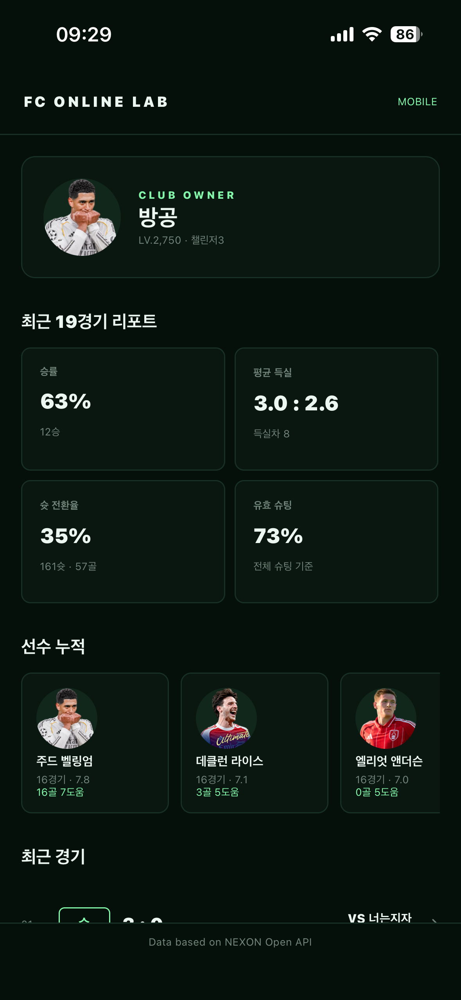
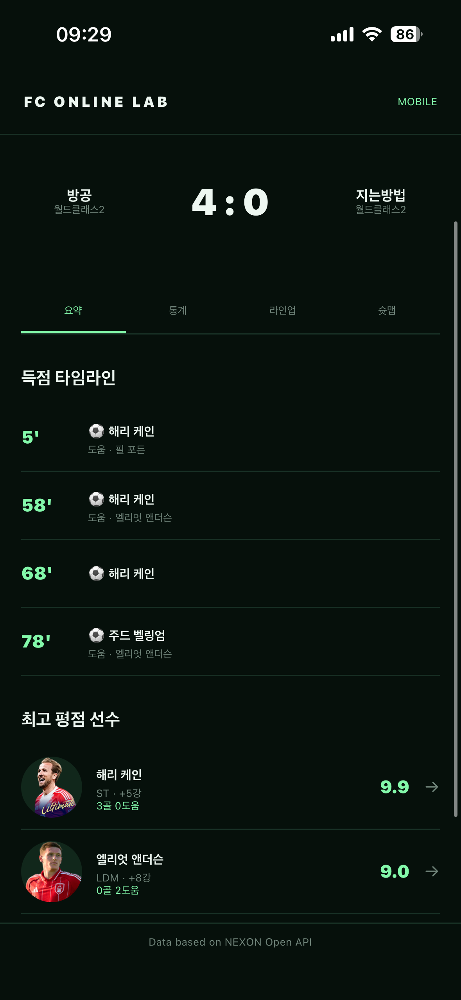
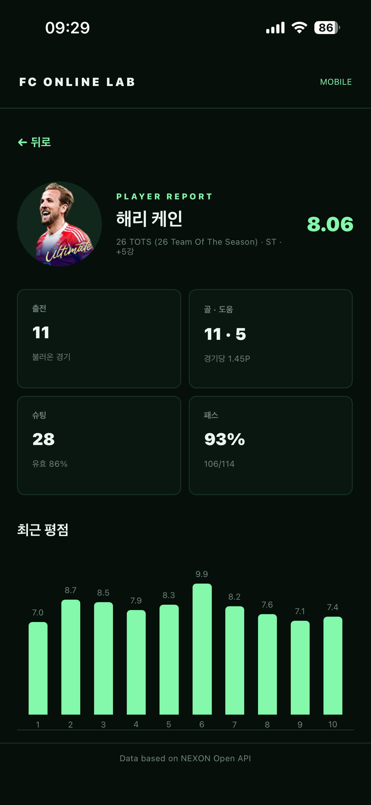

# FC Online Lab

FC Online 경기 기록, 득점 흐름, 슈팅 위치, 선수 평점과 선수 정보를 확인하는 데스크톱·모바일 애플리케이션입니다.

다른 환경에서 개발을 이어갈 때는 [PROJECT_STATUS.md](PROJECT_STATUS.md)의 현재 구조, 배포 상태와 인수인계 항목을 먼저 확인하세요.

Data based on NEXON Open API

## 실제 구동 화면

<table>
  <tr>
    <th>종합 리포트</th>
    <th>경기 상세</th>
    <th>플레이어 리포트</th>
  </tr>
  <tr>
    <td></td>
    <td></td>
    <td></td>
  </tr>
</table>

> iOS 실제 단말에서 실행한 화면입니다. Android와 iOS는 동일한 화면·데이터 코드를 공유합니다.

## 주요 기능

- 구단주명 기반 최근 경기 조회
- 경기 요약, 득점·도움 타임라인, 통계, 라인업, 슈팅 맵
- EA SPORTS FC ONLINE 데이터센터 기반 선수 검색·상세 정보
- 최고 평점 선수를 활용한 대표 이미지
- 요청 취소·timeout·429·재시도와 파서 부분 실패 안내
- 익명 request ID 기반 클라이언트/서버 오류 연결 및 버전 표시

## 개발 실행

```bash
npm install
npm run dev
```

### Android / iOS 공통 앱

```bash
cd apps/mobile
npm install
npm run android  # Android
npm run ios      # iOS (macOS 필요)
```

모바일 앱은 Expo와 React Native를 사용하며 Android와 iOS가 하나의 화면·데이터 코드를 공유합니다.

### API 백엔드

Cloudflare Workers 백엔드는 NEXON Open API 키를 Secret으로 보관하고 클라이언트에 전적 데이터를 전달합니다.

```bash
cd apps/api
npm install
cp .dev.vars.example .dev.vars # 개발 키 입력, Git 제외
npm run dev
```

운영 키는 `npx wrangler secret put NEXON_API_KEY`로 등록하며 코드나 Git에 저장하지 않습니다.

## 품질 검사

```bash
npm test
npm run typecheck
npm run build
```

운영 지표, 오류 원인 분류, 개인정보 제외 기준과 CORS 정책은 [OBSERVABILITY.md](OBSERVABILITY.md)를 확인하세요.

## 설치 파일 생성

```bash
npm run dist:mac
```

Windows와 Linux는 각각 `npm run dist:win`, `npm run dist:linux`를 사용합니다. 결과물은 `release/`에 생성됩니다.

## 개인정보 및 배포

API 키는 저장하지 않습니다. 구단주명만 사용자 기기의 Electron 애플리케이션 데이터 폴더에 저장합니다. 자세한 내용은 [PRIVACY.md](PRIVACY.md)를 확인하세요.

[RELEASE_CHECKLIST.md](RELEASE_CHECKLIST.md)의 미완료 항목을 확인하세요. 공개 배포 전 개인정보 문의 연락처와 플랫폼 코드 서명 설정이 필요합니다.

FC Online 및 NEXON은 각 권리자의 상표입니다. 본 프로젝트는 NEXON의 공식 애플리케이션이 아닙니다.
